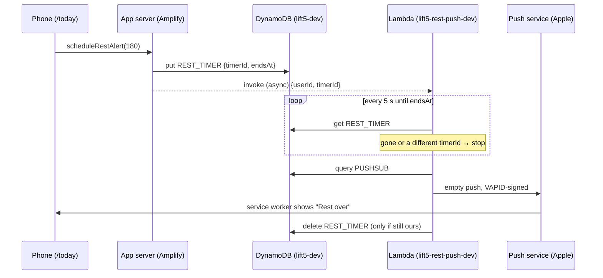

# The workout screen: progress, rest timer and rest alerts

How `/today` keeps a workout going while you train: adjusting a weight mid-workout, keeping
logged sets when you leave the page, a rest timer that keeps real time, and push alerts when a
rest is over. Built and deployed 2026-10-07/08; see `todo.md` §9 for the change history.

## Adjusting a weight mid-workout

Tap a lift's weight on `/today` to open a full-screen adjuster:

- a big number you can type into, plus −/+ buttons
- the small step is the smallest change you can load (one smallest plate each side, e.g.
  2.5 kg); the big step is four of those (`lib/weight-adjust.ts`)
- it never goes below the bar, and shows the plates live, with "(loads X)" when your plates
  can't make the exact weight

**Save weight** calls `setLiftWeight` (`app/today/actions.ts`), which stores the lift's new
working weight straight away. Progression at the end of the workout then starts from the weight
you actually lifted, and Settings shows the new value.

> **Never call `revalidatePath` from an action the workout screen uses.** Revalidating also
> refreshes the page that called the action. `/today` gets a fresh session id on each render
> and uses it as the workout's React `key`, so a refresh remounts the workout. Before the saved
> progress below existed, that wiped every logged set; it was found by click-testing. The
> workout screen updates its own copy of the weight instead, and `/settings` reads cookies, so
> it always renders fresh anyway.

## Keeping progress when you leave the page

Logged sets, missed reps and the rest timer are saved in the browser's `localStorage` under
`lift5:workout:<userId>` after every change (`lib/workout-progress.ts`). Coming back to
`/today` restores them, whether you went to Settings, reloaded, or iOS unloaded the tab while
you were in another app.

- Only today's workout of the same type (A/B) is restored. A save from another day, or from
  the other workout, is ignored.
- Finishing the workout clears the save.
- It's per device: progress doesn't follow you to another phone mid-workout.
- If storage is unavailable (private browsing, blocked), the workout still works; it just
  can't be restored.

`WorkoutSession` renders in the browser only (`app/today/WorkoutSessionLoader.tsx`, using
`next/dynamic` with `ssr: false`). That lets it read `localStorage` in its first render
without the server-rendered HTML, which can't see `localStorage`, disagreeing with it.

## The rest timer

Logging a set starts the rest (the length is set in Settings). The timer stores the time the
rest **ends** and works out what's left from the clock (`restRemainingSeconds`). iOS pauses
timers on a hidden page, so counting down tick by tick fell behind real time; this way the
time is right as soon as you come back.

- It beeps and vibrates when it reaches zero while you're watching.
- Coming back after it ran out doesn't beep late; the timer just disappears.
- **+30s** restarts it with 30 more seconds; **Skip** stops it.

While the app is in the background, the page can't make a sound. That's what rest alerts are
for.

## Rest alerts (push notifications)

A notification, "Rest over: time for your next set", arrives when a rest ends, even with the
phone locked or another app open. On iPhone it needs iOS 16.4 or later and Lift5 opened from
the Home Screen (Safari tabs can't receive web push). No native app or Apple developer account
is involved.

### Why the server sends it

A web app can't schedule a notification on the phone, and iOS pauses it in the background, so
the alert has to come from the server at the right moment.

### The pieces

| Piece | Where | What it does |
|---|---|---|
| Workout screen | `app/today/WorkoutSession.tsx` | `startRest` calls `scheduleRestAlert(seconds)`; Skip and finishing call `cancelRestAlert`. Both are fire-and-forget: the on-screen timer works without them. |
| Server actions | `app/rest-alerts/actions.ts` | `scheduleRestAlert` writes `REST_TIMER` and invokes the Lambda, but only if the user has a subscription and `REST_PUSH_FUNCTION` is set. Rests are capped at 840 s, inside the Lambda's 15-minute limit. Also saves and removes subscriptions, and sends the Settings test (a 5 s rest). |
| Lambda | `app/lambda/rest-push/index.mjs` | Polls `REST_TIMER` every 5 s, so Skip, +30s or the next set stop it within one poll. When the rest ends, pushes to every subscription, removes any the push service reports as gone (404/410), and clears the timer. Ignores a rest that ended over 60 s before it got there. |
| Service worker | `app/public/sw.js` | `push` shows the notification; tapping it focuses the app or opens `/today`. |
| Settings | `app/settings/RestAlerts.tsx` | Turn on, Send a test, Turn off, per device. Explains the Home Screen step on iPhone Safari, and what to do if alerts are blocked. Hidden when `VAPID_PUBLIC_KEY` isn't set. |
| Endpoint check | `lib/push-endpoint.ts` | Only accepts subscription URLs on the browsers' push services (Apple, Google, Mozilla, Microsoft), so a crafted "subscription" can't make the Lambda POST to any URL. |
| Infrastructure | `infra/rest-push.yaml`, `infra/amplify-role.yaml` | The function, its role and log group; the app's permission to invoke it. |

### Design choices

- **Empty pushes.** Apple allows a push with no body, so there's no message encryption and
  no dependencies, only the VAPID signature (ES256 JWT, `sub` = the site URL, `exp` 12 h; Apple
  rejects more than 24 h). The service worker supplies the text. Headers: `TTL: 60` (a late
  rest alert is useless), `Urgency: high`, `Topic: rest-timer`.
- **Every push shows a notification**, even with the app open. Safari revokes push permission
  from sites whose pushes don't. The shared `tag` keeps it to one notification.
- **A waiting Lambda, not a scheduler.** Sleeping in a Lambda is accurate to the second,
  can be cancelled by deleting one item, and stays inside the free tier at one person's usage
  (about 23 GB-seconds per 3-minute rest). Async invokes don't retry and are dropped if
  queued for over 60 s; reserved concurrency of 5 caps runaway cost.
- **A new `timerId` for each rest**, so an older waiting Lambda sees it was replaced and stops,
  and its clean-up can't delete the newer timer (conditional delete).

### Data

Both items live in the main table under `PK = USER#<userId>`; key helpers are in
`lib/db/schema.ts`, and the Lambda uses the same literal keys.

| SK | Attributes | Lifetime |
|---|---|---|
| `PUSHSUB#<first 32 hex of sha256(endpoint)>` | `endpoint`, `createdAt` | Until turned off in Settings, or removed by the Lambda after a 404/410 |
| `REST_TIMER` | `timerId`, `endsAt` (unix ms, server clock) | From rest start until it fires, is skipped, or the workout finishes |

### Configuration

| Setting | Where | Value |
|---|---|---|
| `VAPID_PUBLIC_KEY` | Amplify env (and the build spec's `env \| grep` line, see `todo.md` §1) | Public key; the browser subscribes with it |
| `REST_PUSH_FUNCTION` | Amplify env (same) | `lift5-rest-push-dev` |
| `VAPID_PUBLIC_KEY`, `VAPID_PRIVATE_KEY`, `VAPID_SUBJECT`, `DYNAMODB_TABLE` | Lambda env, set by the `lift5-rest-push` stack parameters | The private key exists only here, never in the repo |

Without `REST_PUSH_FUNCTION` (local dev, `gate-verify`), scheduling does nothing. Without
`VAPID_PUBLIC_KEY`, the Settings section is hidden.

### Deploying changes

- **Lambda code** (`index.mjs`): `infra/deploy-rest-push.sh`. The stack only holds placeholder
  code, so a stack deploy alone doesn't update it.
- **Stack** (`rest-push.yaml`): `aws cloudformation deploy --region ap-southeast-2
  --template-file infra/rest-push.yaml --stack-name lift5-rest-push --capabilities
  CAPABILITY_NAMED_IAM`, reusing the existing key parameters (`--parameter-overrides
  VapidPublicKey=… VapidPrivateKey=…` only when replacing the keys). Then run the deploy script.
- **App**: push to `main`; Amplify builds it.

### Replacing the keys

If the private key is lost or leaked, generate a new P-256 pair, redeploy the stack with both
keys, set the new `VAPID_PUBLIC_KEY` in Amplify and rebuild. Existing subscriptions were made
with the old public key, so Apple will reject pushes to them. Turn alerts off and on again on
each device, and delete stale `PUSHSUB#` items if any remain.

### Testing

- **Unit tests:** `app/lambda/rest-push/index.test.mjs` (signature, headers, the polling loop),
  `lib/__tests__/push-endpoint.test.ts`, `lib/__tests__/workout-progress.test.ts`,
  `lib/__tests__/weight-adjust.test.ts`.
- **Locally, end to end:** run the real handler against DynamoDB Local
  (`AWS_ENDPOINT_URL_DYNAMODB`) with subscriptions pointing at a small local HTTP server that
  plays the push service. That checks timing, the signature, skip, replacement and 410
  clean-up. The endpoint check stops `savePushSubscription` storing a localhost URL, so write
  those `PUSHSUB#` items directly.
- **Real push:** only on a device. Chrome under automation can't register with Google's push
  service (`AbortError: Registration failed - permission denied`), and headless Chrome reports
  `Notification.permission` as `denied`. Use Settings → Send a test on the iPhone.

### Troubleshooting

1. **No alert at all:** check Settings → Rest alerts says "On for this device". Check iOS
   Settings → Notifications → Lift5, and that Focus or Do Not Disturb isn't hiding it.
2. **Check the Lambda log** (`/aws/lambda/lift5-rest-push-dev`, kept 14 days). Each run logs
   `{userId, timerId, result}`:
   - `sent`: the push went out. A `push rejected <status>` warning means the push service
     refused it; 403 usually means the keys don't match the subscription.
   - `cancelled`: skipped, finished, or replaced by a newer rest.
   - `stale`: the Lambda started more than 60 s after the rest ended.
   - `timed-out`: the rest was longer than the Lambda can wait.
   - No log line: `scheduleRestAlert` didn't invoke it. Either the user has no subscription
     or `REST_PUSH_FUNCTION` isn't reaching the app at runtime (check the build spec's
     `env | grep` line).
3. **The app is still on an old service worker:** close Lift5 from the app switcher and reopen
   it from the Home Screen.
